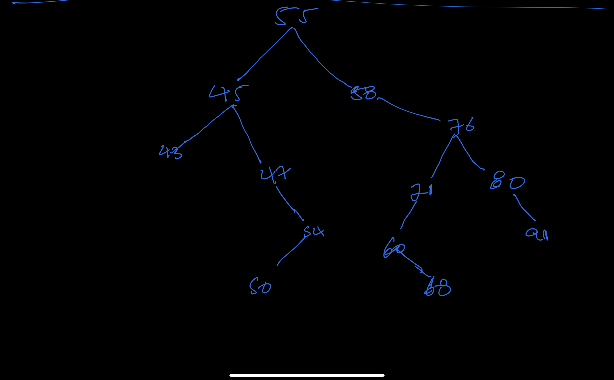

# DS_assignment9
a. Create a binary tree for the given set of nodes. [ Manually ]
55 45 47 43 54 58 76 71 50 60 68 80 91
b. Write the In-order traversal
c. Write the Pre-order traversal
d. Write the Post-order traversal
e. What is the successor of 76 and 47
f. Draw a tree after removal of 50 & 68 leaf nodes(Case – 1)
g. Draw a tree after removal of node has one left child and node has one right child (Case -2) – Remove 47 and 80
h. Draw a tree after removal of node has two child. (Case -3) – Test all the sub cases.(Case-3a, Case-3b, Case-3c) – Remove 45 and 76

Note: Similarly practice by yourself for all the operations of binary search trees by setting different values. Check your answer through the given link for insertion and traversal. For the deletion, you have to follow the rules from your textbook.

2. Implement the following methods in the BinarySearchTree.java file. in your demo code folder.

a. Implement the code for void preOrder(){ }
b. Implement the code for void postOrder(){ }
c. Implement the code to count the leaf nodes int leafCount(){}

/*todo ---> after removing 47 the successor will become 50
todo --->  after removing 76 the succesor will be become 80

        todo after removing 50 and 68
                                        55
                                        /\
                                       /  \
                                      45   58
                                    /  \     \
                                   /     \     \
                                 43      47   76
                                        /     / \
                                       /     /   \
                                     54    71     80
                                        /          \
                                       /            \
                                     60             91

         todo after removing 47 and 80 the tree will look the same but minus two leaf(external nodes)
                                        55
                                        /\
                                       /  \
                                      45   58
                                    /  \     \
                                   /     \     \
                                 43      54   76
                                             / \
                                            /   \
                                         71      91
                                        /
                                       /
                                     60

            todo The draw after removing 47 and 80
                                        55
                                        /\
                                       /  \
                                     54   58
                                     /      \
                                   /          \
                                43            91
                                             /
                                            /
                                         71
                                        /
                                       /
                                      60
